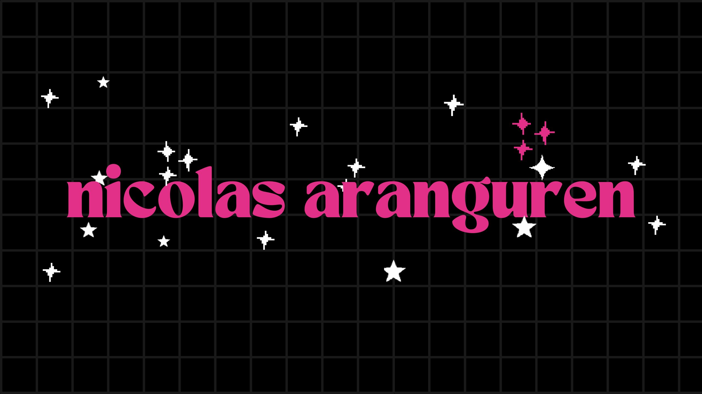

# Nicolás Aranguren García

## About Me 👋✨

Hello! I'm **Nicolás Aranguren García** 🎓, a Statistics student at the National University of Colombia 🇨🇴. I have a strong passion for **Data Science** 📊, **Artificial Intelligence** 🤖, and **Business Intelligence** 📈. I’m always looking for ways to apply my statistical knowledge to solve real-world problems 🔍.

---

## Interests 🌟

- **Data Science** 📊🔍
- **Artificial Intelligence** 🤖💡
- **Business Intelligence** 📈📊

---

## Technologies I Use 🛠️💻

    
🐍 Python

    
📊 R

    
📅 SQL

    
📉 Tableau

    
📊 Power BI

    
🤖 TensorFlow

    
🧠 Scikit-learn

    
📊 Pandas

    
📈 Matplotlib

    
🔢 NumPy

---

## Contact 📬🌐

You can find me on [LinkedIn](https://www.linkedin.com/in/nicolas-aranguren) or on my [GitHub](https://github.com/nicolas-aranguren). I’d love to connect! 🤝✨

---

Thank you for visiting my profile! 😊🎉

